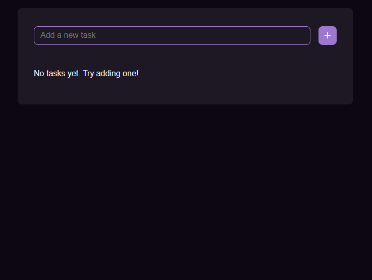

# ✅ EzTodo

A simple to-do app made to learn Angular.

See [a live demo here](https://matthewwid.github.io/ez-todo/).

Based on [this design](https://www.figma.com/community/file/1348652218299666548) by [@lucasviga](https://github.com/lucasviga).

<p align="center">
  
</p>

## Features

- 📃 Create and delete tasks.
- ✔ Check tasks off as completed.
- 💻 Tasks are persisted in browser storage.

## Development

Install Node:

```bash
curl -L https://git.io/n-install | bash
n auto
```

Install pnpm:

```bash
npm i -g pnpm
```

Install dependencies:

```bash
pnpm i
```

Run development server:

```bash
pnpm run dev
```

Build for production:

```bash
pnpm run build
```

## License

This project is licensed under the [MIT license](https://opensource.org/license/mit/).
